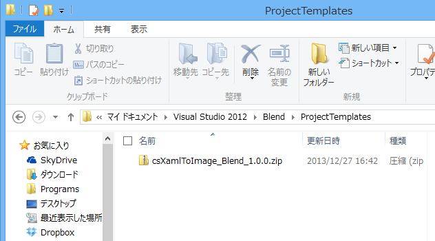
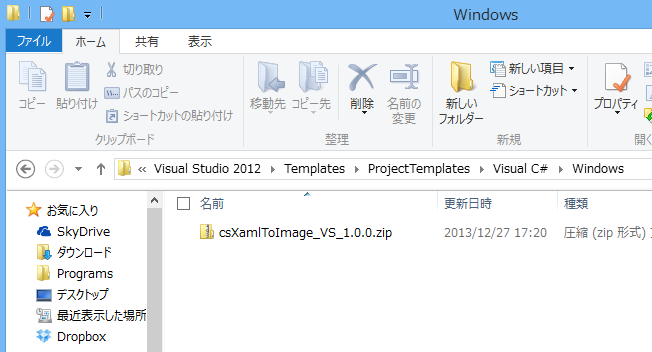

## XAML to Image

"XAML to Image" is a project template for Blend for Visual Studio and/or Visual Studio.  
By using the template, you can design images or icons as XAML, and export image files such as PNG, GIF, etc.

### Prerequisites
Visual Studio 2012, or later.  
(I tested with Visual Studio 2012 only.)

### Settings
#### Download project templates
1. Download the latest version of project templates (for Blend and/or for VS) from [Download](Download).
  * [csXamlToImage_Blend_1.0.0.zip](Download/csXamlToImage_Blend_1.0.0.zip)
  * [csXamlToImage_VS_1.0.0.zip](Download/csXamlToImage_VS_1.0.0.zip)

#### Settings for Blend
1. Open "%USERPROFILE%\Documents\Visual Studio 2012\Blend\ProjectTemplates" folder.
1. Copy csXamlToImage_Blend_xxx.zip there.

#### Settings for Visual Studio
1. Open "%USERPROFILE%\Documents\Visual Studio 2012\Templates\ProjectTemplates\Visual C#" folder.
1. Make "Windows" folder, and copy csXamlToImage_VS_xxx.zip there.

