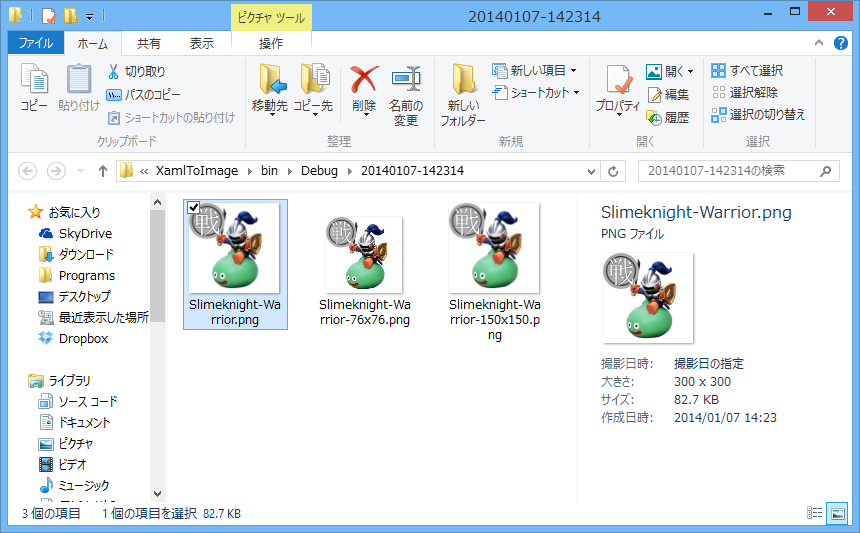

## XAML to Image

"XAML to Image" is a set of project templates for Blend for Visual Studio and/or Visual Studio.
By using the templates, you can design images or icons as XAML, and export image files such as PNG, GIF, etc.

1. Edit XAML with Blend for Visual Studio.  
  
1. Run the app, then image files are created.  
  

Other samples:  
  

### Prerequisites
Visual Studio 2012, or later.  
(I tested with Visual Studio 2012 only.)

### Setup
See [Setup](https://github.com/sakapon/XAML-to-Image/wiki/Setup).

### Tutorials
* [First Steps](https://github.com/sakapon/XAML-to-Image/wiki/First-Steps)
* [Usage](https://github.com/sakapon/XAML-to-Image/wiki/Usage)

### Extensibility
You can customize this template to suit your needs, such as file naming rules or adding dynamic image effects, etc.
